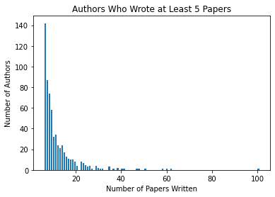
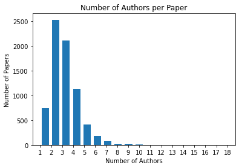
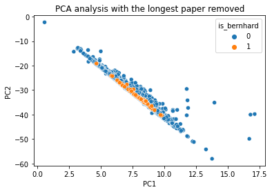
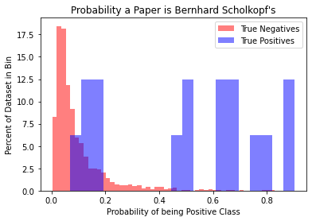
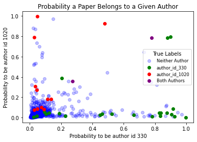

# Predicting Authorship of Scientific Papers with NLP

## Overview
In this project, I examined a dataset of ~7,200 scientific papers, and built a **natural language processing classifier** that used the text of the paper itself in order to predict its authorship. Throughout the project I explored **text vectorization**, used multiple stratigies to deal with a **highly imbalanced dataset**, and created a **multi-target multi-output classifier**. My final model was unable to firmly predict authorship just based on the text, but was able to achieve much better than random performance and could be used to seperate papers that are clearly the author's from ones that need a human to check.

## Business Case
 Plagiarism in scientific writing has been a difficult problem to solve, with many scientific journals publishing articles from “paper mills” that were not written by their supposed authors. For example, “International Publisher Limited” is a Russian paper mill company that offers authorship on soon to be released scientific papers [for up to $5000](https://www.science.org/content/article/russian-website-peddles-authorships-linked-reputable-journals). While these operations often target less reputable journals, even reputable publishing houses such as Elsevier have published articles from these mills. Natural language processing as a machine learning technique has progressed greatly over the past few years, and may offer a potential solution. By developing a model that can read a paper’s text and determine likely authorship, this kind of academic fraud could be caught more easily.

## Data Source
https://www.kaggle.com/datasets/benhamner/nips-papers

## Data Wrangling
[The dataset](Notebooks/Data_Wrangling.ipynb) consists of three csv files: "authors.csv", "papers.csv", and "paper_authors.csv" that joins the other two on author_id and paper_id. papers.csv contains the text of the paper in question, as well as its title, abstract, year published, and its "event type" (poster, oral presentation ect.). **Four of the papers had duplicated paper_text fields**, but these were left in and dealt with in a later notebook. authors.csv is the plaintext name of the author of the paper, as well as a numeric author_id. **Some identical author names had different author_ids**, including the most prolific author in the dataset. This was corrected, and a new .csv was created with the author_id and all of the information on the papers.csv in one place. One issue is that there is **no record of who was the primary author** for any paper, which may have been very predictive.

               

## Predicting an Author from the Title
[In this notebook](Notebooks/One_Author_From_Title.ipynb), I looked at trying to predict if one person, in this case Bernhard Scholkopf, was the author of a paper based only on its title. This involved using scikit-learn's **Tfidf vectorizer** to convert the words in the titles to numbers (vectors). The vectorizer turns each word in each title into a new feature, with the values being the relative frequency those words appear in each document. This creates a very sparse matrix of new numeric features (4865 in this case) and importantly is a "bag of words" representation, where the order and context of the words is not kept. It is, however, reletively computationally inexpensive compared to more complex deep learning approaches. 

One of the major problems with this dataset is how imbalanced it is, the most prolific author only accounts for **~1.5% of the dataset**, so when predicting for Bernhard's papers I tried **class weighting**, **oversampling**, and **undersampling** strategies in order to see what effect they had on the model.

## Predicting One Author from the Paper Text
Predicting one author from the text of the paper was broken into two notebooks, [the first](Notebooks/One_Author_advanced.ipynb) focused on **creating new features** (title length, paper length, and average word length) then fitting a simple logistic regression model to all of those features. This gave an AUC score of ~0.71, but checking performance on the train set indicated there may be some overfitting. I used **GridSearchCV** to check multiple values of the regularization parameter "C", but that returned the same value of C I had been using before, I wanted to check if that was accurate myself. In addition, using different train/test splits created large differences in model performance, which the following notebook would attempt to account for.

[The second notebook](Notebooks/One_Author_advanced_2.ipynb) features checks of **logistic regression**, **LinearSVD**, and **Random Forest** models in a "manual" grid search that allowed me to check individual model performance across multiple hyperparameters and against each-other, using F2-score as the metric to judge performance. 

One other experiment was using **TruncatedSVD** for dimentionality reduction (similar to PCA analysis but it works on sparce matricies like mine) in order to do some basic topic modeling, but I was unable to use more than 1000 components on my machine, and everything 1000 components or less led to very poor model performance. Graphing just the first two principal components showed that one paper was a clear outlier in both, possibly due to its length or the number of newline characters. The PCA graph after that paper was removed was much more reasonable but highlighted the problem, the Bernhard papers were indistinguishable from the others

Next, it was time to do **"manual" cross validating** on the logistic regression model and LinearSVD model, in order to get an idea of performance across several train/test splits. The LinearSVD model was found to give the best performance, but did not have the ability to easily predict probabilities like the logistic regression model, which would be important in later analysis. This gave me an average F2 score of 0.4 on the logistic regression model, which had a regularization parameter C=1 and used random oversampling. 

Finally, I wanted to check feature importance for the final model, and used **predict_proba** to get the predicted probabilities of the negative and positive cases for the papers. While confusion matricies and hard yes/no answers are useful for comparing models to each other, the probability a given author wrote a paper would better suit the real world use case of the model, and shows a middle ground of "possibly this author's papers" that would otherwise be lost.

## Predicting Multiple Authors at Once
[The final part of this project](Notebooks/Many_Authors.ipynb) was using the dataset to do **multi-target, multi-output classification**. An important fact is that each paper can and probably does have multiple authors, so a new dataframe was created with each paper as a row and each author_id as a feature, indicating which author(s) wrote each paper. 

Next, a small test was run to predict the papers of author_id 330 and author_id 1020. These authors were chosen because they co-wrote a large number of papers. Using sklearn's **MultiOutputClassifier** allowed me to use LogisticRegression to predict for both authors. Graphing the probabilities of each showed that the model was able to largly seperate the papers each author wrote, while the papers they co-wrote lie between them. Of course there remained a core of papers from both that were indistinguishable from the other papers.

Finally I tested sklearn's **MultiOutputClassifier** and **ClassifierChain** against the top five, ten, and fifteen authors; and cross-validated the results. ClassifierChain, unlike MultiOutputClassifier, arranges all of the models into a chain, where the predictions from earlier models are fed in as features to later models. This in theory allows information from earlier author predictions to benefit later predictions, but in this case the results from both stratigies **were almost identical**. It's possible that there is no more information that can be reasonably gained from my Tfidf vectors, or that I would need to do much more careful feature engineering to get better results. Interestingly, both strategies worked best with ten authors, then fifteen, and finally five. While adding more authors that have fewer papers to train on should obviously negatively impact model performance, why have worse performance on the authors with the most examples? Its possible that the most prolific authors in the dataset also actually wrote less of the papers themselves, as they're more likely to be famous academics who were listed as an author without doing much of the writing.

## Conclusion and Next Steps
While the final model was not good enough to be able to firmly predict if an author wrote a paper based just on its text, it was able to achieve performance (F2_scores ~0.46) **much better than random** given the large imbalance in this dataset. Looking at the model's probability predictions also showed that **seperation from the bulk of papers** was achieved in many cases even when not shown on the confusion matrix. A model like this could never be used to detect spurious papers on its own, but it could be useful at seperating papers that are clearly the author's from ones that need a human to check. 

Some potential performance improvements could be made by moving to a more sophisticated vectorizer, such as **spaCy** or **sBERT**, that can vectorize sentences or otherwise keep some word-order information. These tools would be especially useful if I had the computing power to train them on my own dataset, but even "out of the box" models might give some improvement. In addition, this dataset did not have any information on which author was the primary author, which would have been very predictive for the actual writing style and topics discussed in the paper itself.